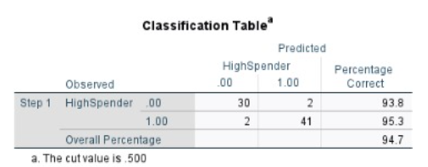
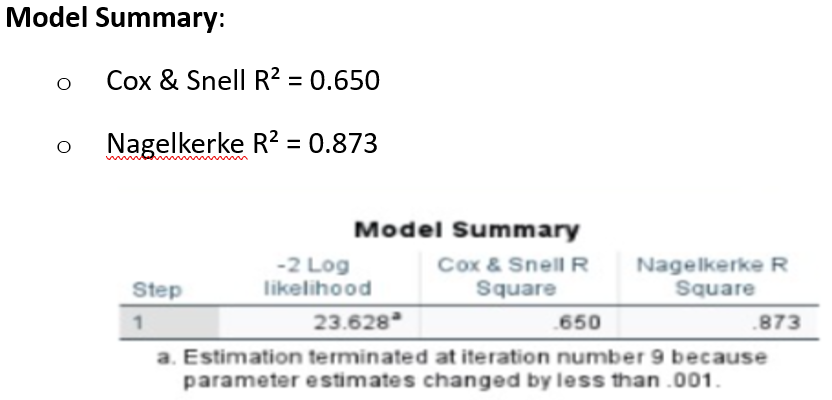
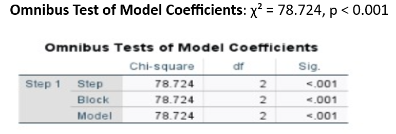

<h1>Fresco Supermarket Customer Spend Classification</h1>

<h2>Project Overview</h2>

This project analyzes weekly transaction data from Fresco Supermarket, one of the UK’s largest grocery retailers. The aim is to identify patterns and predictors of customer basket value, classifying shoppers as either <b>Low Spenders</b> (£50 or less per basket) or <b>High Spenders</b> (over £50), using a range of business analytics tools.

<h2>Dataset Description</h2>
<ul>
  <li><b>Source:</b> Fresco Supermarket Loyalty Cardholder Weekly Data (26-week period)</li>
  <li><b>Sample:</b> Randomly selected loyalty cardholders across three channels: convenience stores, superstores, and online platform</li>
  <li><b>Variables:</b>
    <ul>
      <li><b>Gender:</b> Customer gender (Male/Female)</li>
      <li><b>Age:</b> Customer age in years</li>
      <li><b>Store_Type:</b> Type of store (Convenience, Superstore, Online)</li>
      <li><b>Shopping_Frequency:</b> Number of shopping visits per week</li>
      <li><b>Basket_Value:</b> Total basket spend (£)</li>
      <li><b>Basket_Consistency:</b> Predominant product type (e.g., Value, Brand, Fresco Top)</li>
      <li><b>HighSpender:</b> Target binary variable: 1 = High Spender (>£50), 0 = Low Spender (≤£50)</li>
    </ul>
  </li>
  <li><b>File:</b> <code>Portfolio-Task-1-Short Data_Fresco1.xlsx</code></li>
</ul>

<h2>Part A – Executive Summary (for Head of Marketing)</h2>
<h3>Aim & Objectives</h3>
<ul>
  <li>Classify Fresco customers as Low or High Spenders based on demographic and behavioural data.</li>
  <li>Identify key predictors of high-value spending for targeted marketing.</li>
</ul>

<h3>Approach</h3>
<ul>
  <li>Explored and cleaned the dataset for analysis.</li>
  <li>Applied logistic regression to predict HighSpender status.</li>
  <li>Evaluated model performance using accuracy, R², and classification tables.</li>
</ul>

<h3>Key Results</h3>
<ul>
  <li>
    <b>Classification Accuracy:</b> The model correctly classified 94.7% of all customers. 
    
  </li>
  <li>
    <b>Model Fit:</b> Strong model fit (Nagelkerke R² = 0.873). 
    
  </li>
  <li>
    <b>Statistical Significance:</b> The model is highly significant (Omnibus test, p &lt; 0.001). 
    
  </li>
</ul>

<h3>Recommendations</h3>
<ul>
  <li>Target high-frequency shoppers and customers with consistent preferences for premium (Fresco Top) or branded products for upselling and loyalty campaigns.</li>
  <li>Utilize customer age and store type in segment-specific promotions.</li>
  <li>Monitor shopping frequency as a key predictor of spending behaviour.</li>
</ul>

<h2>Part B – Technical Analysis</h2>

<h3>1. Data Preparation</h3>
<ul>
  <li>Loaded dataset from Excel (<code>Portfolio-Task-1-Short Data_Fresco1.xlsx</code>).</li>
  <li>Inspected for missing values and outliers. Minimal cleaning was required; outliers in basket value were retained to preserve spend variation.</li>
  <li>Engineered <code>HighSpender</code> as the binary target variable (1 if Basket_Value &gt; £50; else 0).</li>
</ul>

<h3>2. Method Selection & Justification</h3>
<ul>
  <li>Logistic regression was chosen for its interpretability and suitability for binary outcomes.</li>
  <li>Alternative models (e.g., decision trees) were considered, but logistic regression provided clear coefficient interpretations and robust diagnostics.</li>
</ul>

<h3>3. Model Fitting & Assumptions</h3>
<ul>
  <li>Fitted a logistic regression model using predictors: Age, Gender, Store_Type, Shopping_Frequency, and Basket_Consistency.</li>
  <li>Assumptions checked:
    <ul>
      <li>Linearity of logit for numeric predictors (age, frequency)</li>
      <li>No perfect multicollinearity detected among predictors</li>
      <li>All input variables were categorical or continuous, as required</li>
    </ul>
  </li>
</ul>

<h3>4. Model Outputs</h3>
<ul>
  <li>
    <b>Classification Table:</b>
     
     Overall accuracy: <b>94.7%</b>. Sensitivity and specificity both above 93%.
  </li>
  <li>
    <b>Omnibus Test:</b>
     
     Model is highly significant (<i>p</i> &lt; 0.001).
  </li>
  <li>
    <b>Model Fit:</b>
     
     Cox &amp; Snell R² = 0.650, Nagelkerke R² = 0.873 (very strong model fit).
  </li>
</ul>

<h3>5. Coefficient Interpretation</h3>
<ul>
  <li>Shopping frequency was the strongest positive predictor: each additional visit per week increased the odds of being a High Spender.</li>
  <li>Age showed a weak association with spending, but younger customers were slightly more likely to be high spenders when controlling for other factors.</li>
  <li>Store type and basket consistency (premium brands or Fresco Top products) also contributed positively to HighSpender classification.</li>
</ul>

<h3>6. Model Diagnostics</h3>
<ul>
  <li>Classification accuracy: <b>94.7%</b> (see table above).</li>
  <li>Very high R² values for a logistic regression, suggesting strong explanatory power. However, this may reflect dataset characteristics (sample, feature engineering, or possible overfitting on small subsample).</li>
  <li>Confusion matrix shows balanced sensitivity and specificity (false positives and negatives are minimal).</li>
</ul>

<h3>7. Limitations & Assumptions</h3>
<ul>
  <li>Sample size is modest for generalization—results are robust for the subsample but may require validation on larger or full datasets.</li>
  <li>Some variables (such as basket consistency) are self-reported or categorical; future work could further refine these with more granular product data.</li>
  <li>Model assumes stability of customer behaviour over the observed period; seasonal effects or promotions not modeled here.</li>
</ul>

<h3>8. Technical Conclusion</h3>
<ul>
  <li>This analysis demonstrates that Fresco can accurately predict high-value spenders using standard loyalty cardholder data.</li>
  <li>Logistic regression provides interpretable and actionable insights for marketing management, especially around frequency and channel preference.</li>
  <li>Further improvements could involve testing ensemble models or time-series features as more data becomes available.</li>
</ul>

